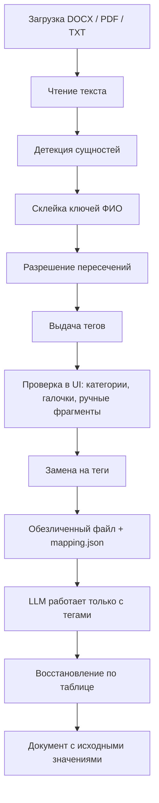

# anonymizer

Веб-приложение для обезличивания юридических документов: находит персональные и идентифицирующие данные, заменяет их на теги вида `[ФИО1]`, затем может восстановить исходный текст по таблице соответствий.

Работает локально. В облачную LLM уходит только обезличенный текст; JSON-таблица с исходными значениями остаётся у вас.

## Возможности

- **Форматы входа:** DOCX, PDF, TXT (несколько файлов за раз — общий реестр тегов).
- **Распознавание:** ФИО, организации, адреса, даты, ИНН, ОГРН, КПП, СНИЛС, паспорта, счета, БИК, телефоны, email, сайты и прочие персональные данные (Natasha NER + регулярные выражения).
- **PDF-сканы:** если текстового слоя нет, текст извлекается через Tesseract OCR (`vendor/tesseract` или системная установка).
- **Интерфейс:** подсветка найденных фрагментов, выбор категорий для замены, ручное добавление пропущенного, скачивание результата.
- **Восстановление:** вкладка «Восстановление» подставляет исходные значения в ответ LLM по JSON-таблице соответствий.

## Требования

- Python 3.11+
- Зависимости из `requirements.txt` (Streamlit, Natasha, python-docx, PyMuPDF)

## Запуск

1. Установите зависимости:

```powershell
python -m pip install -r requirements.txt
```

2. Запустите приложение (первый анализ документа может занять ~10 секунд — загрузка моделей Natasha):

```powershell
python -m streamlit run app.py
```

Альтернативно:

```powershell
python -m anon
```

Приложение откроется в браузере. Лимит загрузки файлов — до 500 МБ (см. `.streamlit/config.toml`).

## Tesseract OCR

Нужен только для PDF-сканов без текстового слоя. Если PDF уже содержит текст, OCR не используется.

Приложение ищет Tesseract в таком порядке:

- встроенный `vendor/tesseract`;
- `tesseract` в `PATH`;
- стандартные пути Windows:
  - `C:\Program Files\Tesseract-OCR\tesseract.exe`
  - `C:\Program Files (x86)\Tesseract-OCR\tesseract.exe`

Для локальной установки на Windows:

1. Установите Tesseract OCR.
2. Убедитесь, что доступны языки `rus` и `eng`.
3. При необходимости добавьте путь к `tesseract.exe` в переменную `PATH`.
4. Перезапустите приложение.

---

## Полный пайплайн работы с документами

Ниже — что происходит с файлом от загрузки до восстановления ответа LLM. Ядро живёт в пакете `anon/`, интерфейс — в `app.py`.



### 1. Загрузка и чтение

| Формат | Как читается | Как пишется обезличенный результат |
|---|---|---|
| **DOCX** | Абзацы тела, таблиц (включая вложенные) и уже существующих колонтитулов. Текст склеивается через перевод строки, поэтому сущность, разрезанная на два абзаца (адрес на стыке), всё равно находится. Пустые колонтитулы не создаются — иначе Word-файл изменился бы при сохранении. Старый `.doc` (OLE) отклоняется с понятной ошибкой. | Тот же DOCX: замена внутри runs, жирный/курсив и таблицы сохраняются. |
| **PDF с текстом** | Текстовый слой PyMuPDF, страницы через пустую строку. | Новый PDF из обезличенного текста (вёрстка исходника не копируется). |
| **PDF-скан** | Если в среднем меньше 25 символов текста на страницу — Tesseract `rus+eng`, PSM 4, 300 dpi. | Как обычный текст → выбранный формат. Возможны ошибки OCR, в интерфейсе будет предупреждение. |
| **TXT** | `utf-8-sig` → `utf-8` → `cp1251`; иначе utf-8 с заменой символов. | По умолчанию DOCX. |

Несколько файлов в одной сессии делятся одним реестром тегов: «Иванов» в договоре и в приложении получит один `[ФИО1]`.

### 2. Детекция

`Analyzer.detect` собирает кандидатов из трёх источников и только потом чистит пересечения:

1. **Регулярки реквизитов** (`detectors.detect_structured`) — ИНН, счета, даты, адреса и т.д.
2. **Регулярки организаций** (`detect_orgs_regex`) — `ООО «Ромашка»`, `ООО Ромашка` без кавычек, варианты «Сбербанк».
3. **Natasha NER** (`ner.NerEngine`) — ФИО и свободные названия организаций.

Номера арбитражных дел вида `А40-12345/2024` вырезаются из зоны поиска: иначе цифры дела легко принять за телефон или счёт. Сам номер дела в документ не трогается.

### 3. Склейка ФИО и пересечения

- У ФИО ключ группировки — `фамилия|первый_инициал`. «Иванов И.П.» и «Иванову Ивану Петровичу» получают один тег.
- Голая фамилия «Иванов» подтягивается к тому же ключу, **если** в пакете файлов нет второго Иванова с другим инициалом.
- Соседние NER-спаны с пробелом между ними склеиваются («Иванов» + «И.П.» → одно ФИО).
- Если два детектора отметили один и тот же кусок текста, побеждает тип с большим приоритетом, при равенстве — более длинный спан:

  `СНИЛС / счёт / ОГРН / ИНН (10) → паспорт / БИК / КПП (9) → телефон / email / сайт / дата (8) → адрес (7) → организация / ФИО (5) → ручные «другие данные» (4)`

  Поэтому контрольная сумма ИНН важнее, чем NER, который мог бы принять те же цифры за часть организации.

### 4. Теги

`TagRegistry` выдаёт `[МЕТКАN]` по паре `(тип, ключ нормализации)`.

- Теги получают и **выключенные** сущности — чтобы повторное включение категории не сбивало нумерацию.
- В JSON-таблицу попадают только теги, которые реально стоят в файле (включённые).
- Каноническое значение для восстановления — самая длинная нормализованная форма (для ФИО часто именительный падеж от Natasha).

Примеры ключей: ИНН — только цифры; телефон — последние 10 цифр (`+7 916…` и `8 916…` — один тег); сайт — без `https://` и `www.`; дата `15 марта 2024`, `15.03.2024` и `2024-03-15` — один ключ `2024-03-15`.

### 5. Проверка в интерфейсе

- Категории в сайдбаре включают/выключают автонайденные сущности этого типа. Набор категорий запоминается в `%APPDATA%\Anonymizer\config.json`.
- В таблице можно снять галочку с конкретного тега (все вхождения сразу).
- Пропущенный фрагмент: выделить в превью или вставить текстом и указать тип. Если он пересекается с уже включённой сущностью — сначала снимите галочку у неё.
- «Показать результат замены» подставляет теги в превью, не меняя исходный файл.

### 6. Замена в файле

- **DOCX:** координаты сущности пересчитываются в локальные для каждого абзаца. Если адрес перешагнул перевод строки, тег ставится в первый абзац, хвост во втором обнуляется — иначе тег продублировался бы.
- **PDF и TXT:** замена в плоском тексте, затем сборка выбранного формата (PDF через HTML/Story, чтобы кириллица не превращалась в `?`).

### 7. Восстановление

`deanonymize_text` ищет в ответе LLM теги из таблицы и подставляет `canonical`.

Учитываются типичные искажения модели: `[ ФИО1 ]`, `[ФИО 1]`, обёртка `**[ФИО1]**`. Более длинные номера заменяются раньше коротких: `[ФИО10]` не станет `[ФИО1]0`. Теги, которых не было в таблице, показываются предупреждением.

---

## Какие данные находятся

Автоматически ищутся категории ниже. Всё, что детектор не взял, можно добавить вручную (тип «Другое» → тег `[ДАННЫЕ1]`).

### Реквизиты с проверкой формата

| Тип | Тег | Что ловится | Что отсекается |
|---|---|---|---|
| **ИНН** | `[ИННN]` | 10 цифр (юрлицо) или 12 (физлицо/ИП). Либо верная контрольная сумма, либо слово «ИНН» в 24 символах слева (опечатка / тестовый номер). | Случайные 10–12-значные числа без КС и без слова «ИНН». |
| **ОГРН / ОГРНИП** | `[ОГРНN]` | 13 или 15 цифр с КС, либо рядом «ОГРН» / «ОРГН» (частая опечатка). | Длинные числа без КС и без контекста. |
| **КПП** | `[КППN]` | 9 символов `NNNNXXNNN` (в середине допустимы буквы), только если слева есть «КПП». | Те же 9 цифр в сумме иска, номере дела и т.п. |
| **СНИЛС** | `[СНИЛСN]` | `XXX-XXX-XXX XX` или `XXX-XXX-XXX-XX` с контрольным числом ПФР. | Похожая группировка цифр с неверной КС. |
| **Счёт** | `[СЧЕТN]` | 20 цифр, начинается с `30` или `40` (р/с, к/с). | Прочие длинные числа, в том числе суммы. |
| **БИК** | `[БИКN]` | 9 цифр, начинается с `04`, только рядом со словом «БИК». | Индексы и прочие `04…`. |
| **Паспорт** | `[ПАСПОРТN]` | Серия + номер: `45 04 123456`, `4504 123456`, `4504 № 123456`. Нужен контекст в 60 символах слева: «паспорт», «серия», «удостоверение личности». | Голые 10 цифр без этого контекста. |

### Контакты и даты

| Тип | Тег | Что ловится | Что отсекается |
|---|---|---|---|
| **Телефон** | `[ТЕЛЕФОНN]` | `+7` / `8`, код, 7 цифр; пробелы, скобки, дефисы. Ключ — последние 10 цифр. | Номера, не начинающиеся с +7/8; цифры внутри слова. |
| **Email** | `[EMAILN]` | Стандартный `local@domain.tld`, ключ в нижнем регистре. | — |
| **Сайт** | `[САЙТN]` | `http(s)://…`, `ftp://…`, `www.…`, домены с TLD `ru/by/com/org/net/info/biz/su/рф/бел/kz/ua`. Хвост `.,;:!?)]»"'` обрезается. `https://sber-bank.by` и `www.sber-bank.by` — один ключ. | Кусок email (`example.com` после `@`); слишком короткие совпадения. |
| **Дата** | `[ДАТАN]` | `15.03.2024`, `15/03/24`, `15-03-2024`, `15 марта 2024 г.`, `«15» марта 2024`, ISO `2024-03-15`, дата без года `15 марта`. Несуществующие даты (31.02) отбрасываются. Двухзначный год: 00–39 → 2000-е, иначе 1900-е. | Числа, которые не складываются в календарную дату. |

### Адреса

Тип `[АДРЕСN]`. Ключ — строка без пробелов, точек и запятых в нижнем регистре.

Ловятся:

- полный адрес: индекс, населённый пункт, тип улицы, название, дом/владение/строение, корпус/литера, квартира/офис/помещение;
- «улица сначала»: `Невский пр-т, д. 28`; `проспект Независимости, 32А-1`;
- короткие городские формы: `г. Москва`, `г Москвы`, `городе Москве`, `гор. Москвы`;
- списки городов через запятую: `г. Рогачеве, г. Жлобине`;
- шестизначный индекс рядом со словами «адрес», «индекс», «почтово».

Не ловятся (намеренно):

- `г. Рогачеве, г. Жлобине ОАО «БПС-Сбербанк»` — города берутся списком, «ОАО» в адрес не входит, организация остаётся организацией;
- сумма вида `220030 руб` — индекс с «руб/тыс/млн/коп/%» сразу после цифр не берётся;
- «дом 5 марта» / «д. 15.03» — номер дома не должен быть датой или суммой.

### ФИО и организации

| Тип | Тег | Что ловится | Что не трогаем |
|---|---|---|---|
| **ФИО** | `[ФИОN]` | Natasha `PER`, длина ≥ 4. Склейка соседних спанов и ключ `фамилия\|инициал` — см. пайплайн. | Одиночные инициалы, фамилии короче 4 символов. |
| **Организация** | `[ОРГN]` | 1) оргформа + кавычки (`ООО «Ромашка»`), ключ — имя внутри кавычек; 2) оргформа + имя без кавычек (`ОАО БПС-Сбербанк`), не захватывает следующее «ИНН/ОГРН/КПП/БИК»; 3) «Сбербанк», «БПС-Сбербанк» и продолжения; 4) Natasha `ORG`. | Суды, судебные составы, прокуратура, Росреестр, казначейство, «федеральные службы» — нужны для юридического анализа. |

Города и регионы из NER (`LOC`) сами по себе не заменяются: «город Москва» в шапке суда должен остаться. Конкретный адрес проживания/нахождения ловит регулярка адреса.

### Что намеренно не обезличивается

- номера арбитражных дел `А40-12345/2024` и похожие;
- наименования судов и госорганов из списка выше;
- суммы, обычные номера пунктов, статьи законов;
- города/субъекты без уличного адреса (их можно добавить вручную, если в конкретном деле это ПДн).

Детекторы статистические: ложные срабатывания снимаются галочкой, пропуски добавляются вручную. После OCR качество зависит от распознавания, а не от регулярок.

---

## Workflow с LLM

1. Загрузите исходный документ во вкладке «Обезличивание».
2. Проверьте найденные сущности, при необходимости отключите лишнее или добавьте пропущенные фрагменты вручную.
3. Скачайте обезличенный документ и таблицу соответствий (`anonymized.zip` содержит оба).
4. Отправляйте в LLM **только** обезличенный текст или документ с тегами.
5. Сохраните ответ LLM в `txt` или `docx`.
6. Во вкладке «Восстановление» загрузите ответ LLM и исходную таблицу соответствий.
7. Скачайте восстановленный документ.

Таблица соответствий содержит исходные персональные данные — её нельзя передавать в облачные LLM или внешние сервисы.

## Формат выходных данных

| Что скачиваете | Имя файла |
|---|---|
| Один обезличенный документ | `{имя}_anon.docx` или `{имя}_anon.pdf` |
| Несколько файлов | `anonymized.zip` (обезличенные файлы + `_mapping.json`) |
| Таблица соответствий (один файл) | `{имя}.mapping.json` |
| Таблица соответствий (пакет) | `_mapping.json` |
| Восстановленный ответ | `{имя}_restored.docx` / `.pdf` / `.txt` |

PDF на выходе по умолчанию сохраняется как PDF, TXT — как DOCX; формат можно выбрать при скачивании (PDF, DOCX или TXT).

Пример записи в таблице:

```json
{
  "version": 1,
  "created": "2026-08-18T13:00:00",
  "files": ["isk.docx"],
  "tags": {
    "[ФИО1]": {
      "type": "ФИО",
      "canonical": "Иванов Иван Петрович",
      "forms": ["Иванов И.П.", "Иванову Ивану Петровичу"]
    }
  }
}
```

## Структура проекта

```
anon/
  checksums.py   — контрольные суммы ИНН / ОГРН / СНИЛС
  detectors.py   — регулярки реквизитов, адресов, дат, организаций
  ner.py         — Natasha: ФИО и организации
  entities.py    — Entity, типы тегов, TagRegistry, приоритеты пересечений
  engine.py      — пайплайн: детекция, теги, замена, восстановление
  readers.py     — TXT / DOCX / PDF + OCR
  writers.py     — запись обезличенного и восстановленного файла
  config.py      — сохранённые категории UI
app.py           — веб-интерфейс Streamlit
frontend/        — тема и компонент превью с подсветкой
tests/           — pytest и сценарии end-to-end
```

## Тесты

Быстрые unit-проверки:

```powershell
python -m pip install pytest
pytest -q
```

Полный сценарий (детекция, замена, docx round-trip, восстановление):

```powershell
python tests/test_core.py
```

OCR на синтетическом PDF-скане (нужен Tesseract):

```powershell
python tests/test_ocr.py
```

CI: GitHub Actions запускает `pytest -q` на Python 3.11.
