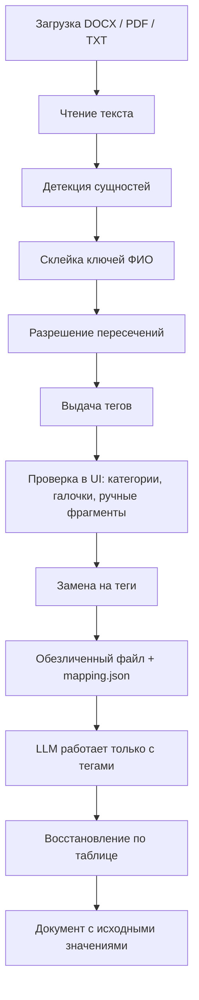

# Пайплайн обезличивания

Что происходит с файлом от загрузки до восстановления ответа LLM. Ядро — пакет `anon/`, интерфейс — `app.py` и `ui/`.

Несколько файлов в одной сессии делятся одним реестром тегов: «Иванов» в договоре и в приложении получит один `[ФИО1]`.

---

## 1. Загрузка и чтение

`readers.load` / `load_from_bytes` даёт плоский текст и, для DOCX, карту абзацев (`LoadedDoc.fragments`).

| Формат | Как читается | Как пишется результат |
|---|---|---|
| **DOCX** | Абзацы тела, таблиц (включая вложенные) и уже существующих колонтитулов. Текст склеивается через перевод строки, поэтому сущность на стыке абзацев всё равно находится. Пустые колонтитулы не создаются — иначе Word-файл изменился бы при сохранении. Старый `.doc` (OLE) отклоняется с ошибкой. | Тот же DOCX: замена внутри runs, жирный/курсив и таблицы сохраняются. |
| **PDF с текстом** | Текстовый слой PyMuPDF, страницы через пустую строку. | Новый PDF из обезличенного текста (вёрстка исходника не копируется). |
| **PDF-скан** | Если в среднем меньше 25 символов текста на страницу — Tesseract `rus+eng`, PSM 4, 300 dpi. | Как обычный текст → выбранный формат. В интерфейсе будет предупреждение об OCR. |
| **TXT** | `utf-8-sig` → `utf-8` → `cp1251`; иначе utf-8 с заменой символов. | По умолчанию DOCX. |

Подробности OCR — в [recognition.md](recognition.md#ocr-pdf-сканов).

---

## 2. Детекция

`Analyzer.detect` собирает кандидатов из трёх источников и только потом чистит пересечения:

1. Регулярки реквизитов (`detectors.detect_structured`) — ИНН, счета, даты, адреса и т.д.
2. Регулярки организаций (`detect_orgs_regex`) — `ООО «Ромашка»`, `ООО Ромашка` без кавычек, варианты «Сбербанк».
3. Natasha NER (`ner.NerEngine`) — ФИО и свободные названия организаций.

Номера арбитражных дел вида `А40-12345/2024` вырезаются из зоны поиска: иначе цифры дела легко принять за телефон или счёт. Сам номер дела не трогается.

Алгоритм каждого детектора — в [recognition.md](recognition.md).

---

## 3. Склейка ФИО и пересечения

После сбора кандидатов:

- У ФИО ключ группировки — `фамилия|первый_инициал`. «Иванов И.П.» и «Иванову Ивану Петровичу» получают один тег.
- Голая фамилия «Иванов» подтягивается к тому же ключу, **если** в пакете файлов нет второго Иванова с другим инициалом.
- Соседние NER-спаны с пробелом между ними склеиваются («Иванов» + «И.П.» → одно ФИО).
- Если два детектора отметили один кусок текста, побеждает тип с большим приоритетом, при равенстве — более длинный спан.

Приоритеты (из `entities.OVERLAP_PRIORITY`):

`СНИЛС / счёт / ОГРН / ИНН (10) → паспорт / БИК / КПП (9) → телефон / email / сайт / дата (8) → адрес / организация (7) → ФИО (5) → ручные «другие данные» (4)`

Контрольная сумма ИНН важнее, чем NER, который мог бы принять те же цифры за часть организации.

---

## 4. Теги

`TagRegistry` выдаёт `[МЕТКАN]` по паре `(тип, ключ нормализации)`.

- Теги получают и **выключенные** сущности — чтобы повторное включение категории не сбивало нумерацию.
- В JSON-таблицу попадают только теги, которые реально стоят в файле (включённые).
- Каноническое значение для восстановления — самая длинная нормализованная форма (для ФИО часто именительный падеж от Natasha).

Примеры ключей:

| Тип | Ключ | Следствие |
|---|---|---|
| ИНН | только цифры | `7707083893` и `ИНН 7707083893` — один тег |
| Телефон | последние 10 цифр | `+7 916…` и `8 916…` — один тег |
| Сайт | без `https://` и `www.` | `https://sber-bank.by` и `www.sber-bank.by` — один тег |
| Дата | ISO `YYYY-MM-DD` | `15 марта 2024`, `15.03.2024` и `2024-03-15` — один тег |

Для пакета файлов вызывается `apply_package_tags`: сначала склейка ключей ФИО по всем файлам, затем выдача тегов.

---

## 5. Проверка в интерфейсе

Пользователь не обязан принимать все автонаходки:

- Категории в сайдбаре включают/выключают автонайденные сущности этого типа. Набор запоминается в `%APPDATA%\Anonymizer\config.json` (на Windows) или `~/Anonymizer/config.json`.
- В таблице можно снять галочку с конкретного тега (все вхождения сразу).
- Пропущенный фрагмент: выделить в превью или вставить текстом и указать тип. Если он пересекается с уже включённой сущностью — сначала снимите галочку у неё.
- «Показать результат замены» подставляет теги в превью, не меняя исходный файл.

---

## 6. Замена в файле

`anonymize_text` / `anonymize_document` подставляют теги только у включённых сущностей (`enabled` и уже есть `tag`).

- **DOCX:** координаты сущности пересчитываются в локальные для каждого абзаца. Если адрес перешагнул перевод строки, тег ставится в первый абзац, хвост во втором обнуляется — иначе тег продублировался бы.
- **PDF и TXT:** замена в плоском тексте, затем сборка выбранного формата. PDF собирается через HTML/Story (PyMuPDF), чтобы кириллица не превращалась в `?`. Исходная вёрстка PDF не копируется.

Формат по умолчанию: PDF → PDF, DOCX → DOCX, TXT → DOCX. При скачивании можно выбрать PDF, DOCX или TXT.

---

## 7. Восстановление

`deanonymize_text` ищет в ответе LLM теги из таблицы и подставляет `canonical`.

Учитываются типичные искажения модели: `[ ФИО1 ]`, `[ФИО 1]`, обёртка `**[ФИО1]**`. Более длинные номера заменяются раньше коротких: `[ФИО10]` не станет `[ФИО1]0`. Теги, которых не было в таблице, показываются предупреждением.

Таблица соответствий содержит исходные персональные данные — её нельзя передавать во внешние LLM.
