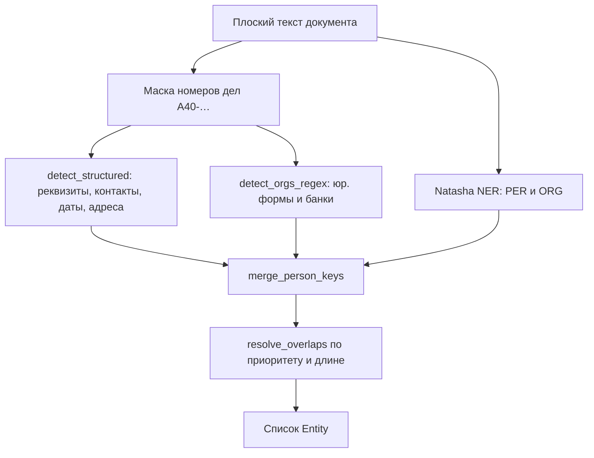

# Алгоритм распознавания

Как находятся персональные и идентифицирующие данные. Детекторы статистические: ложные срабатывания снимаются галочкой в UI, пропуски добавляются вручную.

Автоматически ищутся категории ниже. Всё, что детектор не взял, можно добавить вручную (тип «Другое» → тег `[ДАННЫЕ1]`).

---

## Источники кандидатов

`Analyzer.detect` не выбирает победителя на лету: сначала собирает все спаны, затем чистит пересечения.

| Источник | Модуль | Что находит |
|---|---|---|
| Регулярки реквизитов | `anon/detectors.py` → `detect_structured` | ИНН, ОГРН, КПП, СНИЛС, счета, БИК, паспорт, телефон, email, сайт, дата, адрес |
| Регулярки организаций | `detect_orgs_regex` | `ООО «…»`, `ООО Имя` без кавычек, варианты «Сбербанк» |
| NER | `anon/ner.py` | ФИО (`PER`) и свободные названия организаций (`ORG`) |

Пересечения спанов на этом шаге **не** разрешаются. Финальный набор выбирает `engine.resolve_overlaps`.

### Маска судебных дел

Номера вида `А40-12345/2024` (и латиница `A`) вырезаются из зоны поиска структурированных детекторов. Сам номер дела не обезличивается; без маски его цифры легко принять за телефон или счёт.

---

## Реквизиты с проверкой формата

Общий шаблон (`PatternSpec`): regex + опционально контрольная сумма и/или слово-маркер слева в окне N символов.

Правило приёма (`_accepted`):

- нет ни КС, ни контекста → берём совпадение;
- только контекст → нужен маркер слева;
- только валидатор → нужна верная КС;
- оба → достаточно **либо** верной КС, **либо** маркера (опечатка / тестовый номер рядом со словом «ИНН»).

| Тип | Тег | Что ловится | Что отсекается |
|---|---|---|---|
| **ИНН** | `[ИННN]` | 10 цифр (юрлицо) или 12 (физлицо/ИП). Либо верная КС, либо слово «ИНН» в 24 символах слева. | Случайные 10–12-значные числа без КС и без слова «ИНН». |
| **ОГРН / ОГРНИП** | `[ОГРНN]` | 13 или 15 цифр с КС, либо рядом «ОГРН» / «ОРГН» (частая опечатка). | Длинные числа без КС и без контекста. |
| **КПП** | `[КППN]` | 9 символов `NNNNXXNNN` (в середине допустимы буквы), только если слева есть «КПП». | Те же 9 цифр в сумме иска, номере дела и т.п. |
| **СНИЛС** | `[СНИЛСN]` | `XXX-XXX-XXX XX` или `XXX-XXX-XXX-XX` с контрольным числом ПФР. | Похожая группировка цифр с неверной КС. |
| **Счёт** | `[СЧЕТN]` | 20 цифр, начинается с `30` или `40` (р/с, к/с). | Прочие длинные числа, в том числе суммы. |
| **БИК** | `[БИКN]` | 9 цифр, начинается с `04`, только рядом со словом «БИК». | Индексы и прочие `04…`. |
| **Паспорт** | `[ПАСПОРТN]` | Серия + номер: `45 04 123456`, `4504 123456`, `4504 № 123456`. Нужен контекст в 60 символах слева: «паспорт», «серия», «удостоверение личности». | Голые 10 цифр без этого контекста. |

### Контрольные суммы

Алгоритмы в `anon/checksums.py` совпадают с правилами ФНС / ПФР.

**ИНН-10.** Контрольная цифра = взвешенная сумма первых 9 цифр по коэффициентам `[2, 4, 10, 3, 5, 9, 4, 6, 8]`, затем `mod 11 mod 10`.

**ИНН-12.** Две контрольные цифры:

- 11-я: коэффициенты `[7, 2, 4, 10, 3, 5, 9, 4, 6, 8]`;
- 12-я: коэффициенты `[3, 7, 2, 4, 10, 3, 5, 9, 4, 6, 8]`.

**ОГРН-13.** `int(первые_12) % 11 % 10` должно совпасть с 13-й цифрой.

**ОГРНИП-15.** `int(первые_14) % 13 % 10` должно совпасть с 15-й цифрой.

**СНИЛС.** Сумма первых 9 цифр с весами 9…1; если сумма ≥ 100, берётся `mod 101` (100 → 0). Результат сравнивается с двумя контрольными цифрами.

Ключ группировки для этих типов — только цифры (`digits_only`).

---

## Контакты и даты

| Тип | Тег | Что ловится | Что отсекается |
|---|---|---|---|
| **Телефон** | `[ТЕЛЕФОНN]` | `+7` / `8`, код, 7 цифр; пробелы, скобки, дефисы. Ключ — последние 10 цифр. | Номера, не начинающиеся с +7/8; цифры внутри слова. |
| **Email** | `[EMAILN]` | Стандартный `local@domain.tld`, ключ в нижнем регистре. | — |
| **Сайт** | `[САЙТN]` | `http(s)://…`, `ftp://…`, `www.…`, домены с TLD `ru/by/com/org/net/info/biz/su/рф/бел/kz/ua`. Хвост `.,;:!?)]»"'` обрезается. | Кусок email (`example.com` после `@`); слишком короткие совпадения. |
| **Дата** | `[ДАТАN]` | `15.03.2024`, `15/03/24`, `15-03-2024`, `15 марта 2024 г.`, `«15» марта 2024`, ISO `2024-03-15`, дата без года `15 марта`. | Несуществующие даты (31.02); числа, которые не складываются в календарную дату. |

Сайты обрабатываются после email: если спан пересекается с уже найденным адресом почты, он отбрасывается.

Даты проверяются через `datetime.date`. Двухзначный год: 00–39 → 2000-е, иначе 1900-е. Дата без года получает ключ `--MM-DD`. Разные записи одной календарной даты схлопываются в один тег.

---

## Адреса

Тип `[АДРЕСN]`. Ключ — строка без пробелов, точек и запятых в нижнем регистре.

Ловятся три семейства:

1. **Полный адрес:** индекс, населённый пункт, тип улицы, название, дом/владение/строение, корпус/литера, квартира/офис/помещение. Также «улица сначала»: `Невский пр-т, д. 28`; `проспект Независимости, 32А-1`.
2. **Короткие городские формы:** `г. Москва`, `г Москвы`, `городе Москве`, `гор. Москвы`. Списки через запятую: `г. Рогачеве, г. Жлобине`.
3. **Почтовый индекс:** шестизначное число рядом со словами «адрес», «индекс», «почтово».

Намеренно не ловятся:

- `г. Рогачеве, г. Жлобине ОАО «БПС-Сбербанк»` — города берутся списком, «ОАО» в адрес не входит (стоп-слова юр. форм и `…банк`);
- сумма вида `220030 руб` — индекс с «руб/тыс/млн/коп/%» сразу после цифр не берётся;
- «дом 5 марта» / «д. 15.03» — номер дома не должен быть датой или суммой.

---

## ФИО и организации

| Тип | Тег | Что ловится | Что не трогаем |
|---|---|---|---|
| **ФИО** | `[ФИОN]` | Natasha `PER`, длина ≥ 4. Склейка соседних спанов и ключ `фамилия\|инициал`. | Одиночные инициалы, фамилии короче 4 символов. |
| **Организация** | `[ОРГN]` | 1) оргформа + кавычки (`ООО «Ромашка»`), ключ — имя внутри кавычек; 2) оргформа + имя без кавычек (`ОАО БПС-Сбербанк`), не захватывает следующее «ИНН/ОГРН/КПП/БИК»; 3) «Сбербанк», «БПС-Сбербанк» и продолжения; 4) Natasha `ORG`. | Суды, судебные составы, прокуратура, Росреестр, казначейство, «федеральные службы» — нужны для юридического анализа. |

Города и регионы из NER (`LOC`) сами по себе не заменяются: «город Москва» в шапке суда должен остаться. Конкретный адрес проживания/нахождения ловит регулярка адреса.

### Natasha NER

Модели локальные, работают офлайн. Грузятся лениво при первом вызове (~5–10 сек): `NewsEmbedding`, морфологический теггер, NER-теггер, `NamesExtractor`.

Пайплайн внутри `NerEngine.detect`:

1. Сегментация на токены.
2. Морфологическая разметка.
3. NER-разметка спанов.
4. Фильтрация: `PER` короче 4 символов отбрасывается; `ORG` из списка госорганов отбрасывается; `LOC` игнорируется.
5. Склейка соседних ФИО-спанов, если между ними не больше одного пробела («Иванов» + «И.П.»).

Ключ ФИО: `NamesExtractor` достаёт фамилию и имя, затем `фамилия|первый_инициал` (лемматизированные). Если факта нет — нижний регистр нормализованного спана.

После всех детекторов `merge_person_keys` подтягивает голую фамилию к составному ключу, если в документе (или пакете файлов) ровно один вариант с этим корнем.

---

## Разрешение пересечений

`resolve_overlaps` сортирует кандидатов по убыванию приоритета, затем по длине спана, затем по позиции. Сущность берётся, только если она не пересекается с уже выбранными.

Поэтому `ИНН 7707083893` останется ИНН, даже если NER пометил те же цифры как часть организации.

---

## OCR PDF-сканов

Нужен только если текстового слоя почти нет (в среднем меньше 25 символов на страницу). Иначе берётся слой PyMuPDF.

Поиск Tesseract (`anon/ocr.py`):

1. встроенный `vendor/tesseract`;
2. `tesseract` в `PATH`;
3. стандартные пути Windows: `C:\Program Files\Tesseract-OCR\tesseract.exe` и `(x86)`.

Параметры: языки `rus+eng`, PSM 4 (один столбец текста), 300 dpi, таймаут 180 сек на страницу. Ошибки OCR не роняют разбор, если текст всё же получен: они попадают в `LoadedDoc.warnings`.

После OCR качество детекции зависит от распознавания, а не от регулярок.

---

## Что намеренно не обезличивается

- номера арбитражных дел `А40-12345/2024` и похожие;
- наименования судов и госорганов из списка выше;
- суммы, обычные номера пунктов, статьи законов;
- города/субъекты без уличного адреса (их можно добавить вручную, если в конкретном деле это ПДн).
